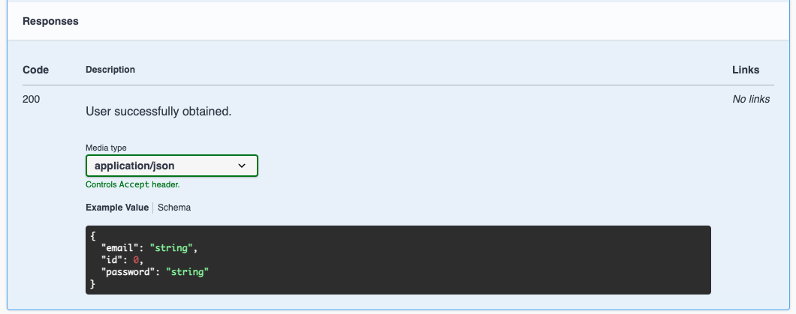

## Monitoring features
This project makes use of Prometheus and Grafana for monitoring. The docker-compose file includes [cAdvisor](https://github.com/google/cadvisor) for general container metrics and [prom-client](https://github.com/siimon/prom-client) is used to expose application metrics.

## Swagger 'autogeneration' example for Express
This project features a Swagger documentation almost automatically generated based on code.

It uses [swagger-autogen](https://github.com/davibaltar/swagger-autogen) to generate a swagger.json. While minimal documentation is generated automatically, some details like response or payload types are not automatically picked up. However, another tool [typescript-json-schema](https://github.com/YousefED/typescript-json-schema) can be used to produce json definitions based on Typescript types

For example this application has an interface "User"
```
export interface User {
  id: number;
  email: string;
  password: string;
}
```
To generate json type for the interface run:
```
typescript-json-schema ./tsconfig.json User > swagger-schema/User.json
````
This can then be referenced in swagger comments like
```
      /*  
          #swagger.responses[200] = {
            description: 'User successfully obtained.',
            schema: { $ref: 'User.json' }
          }
     */
````
This will result in the type definition showing up in Swagger docs




